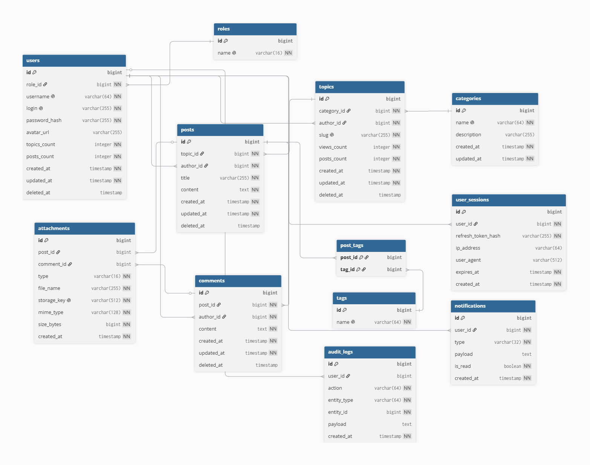
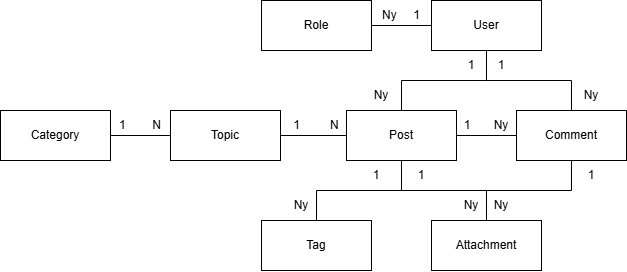

**DBMS - PostgreSQL**

**Type - Relational**

**Entities:**
- User
- Role
- Category
- Topic
- Post
- Comment
- Notification
- Attachment
- Tag
- User session
- Augit logs

## ER Diagram

Link: [database ER diagram](https://dbdiagram.io/d/webforum-6a1c35bdf15b4b04523c2a39)

## Schema Diagram
